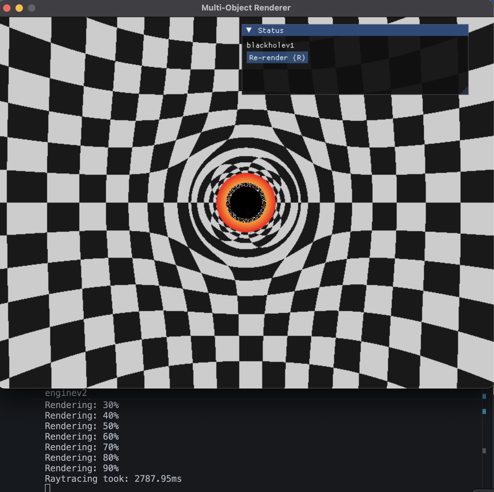
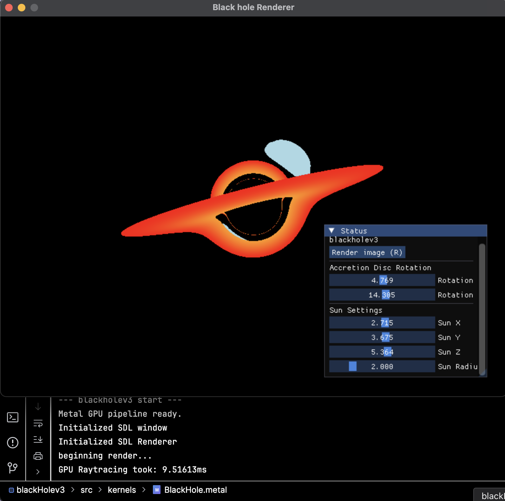
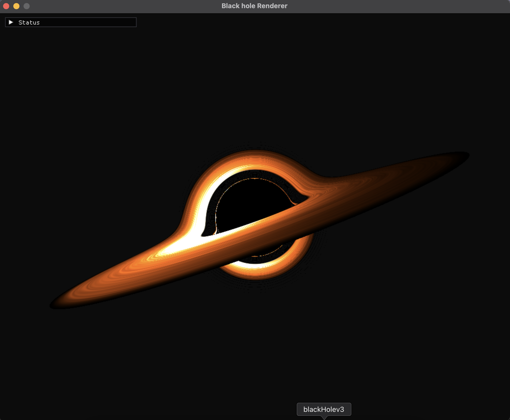

Iris is a a real time GPU-accelerated render engine utilizing MacOS's Metal API for visualizing a non-rotating Shwarzschild black hole. It uses a Runge-Kutta numerical method ran on GPU kernels to solve the simplified null geodesic equations for the non-linear light paths, capturing iconic relativistic phenomena such as gravitational lensing and the photon ring.


### Average render time on Macbook Air M4:

- ~14ms per frame (~70 fps)
- 1000 x 800 screen resolution (~8ms per frame for 800 x 600)
- 0.05 rad step size, 1000 steps

# How to use

The code works right out the box as it contains (almost) all the relevant libraries and dependencies needed. However, this
is designed to work on Macs, more specifically anything with an Apple Silicon chip (M1 or higher), since it uses
Apple GPU kernels for the raytracing. You will need to have Xcode installed to be able to use Metal, and have SDL installed via Homebrew. After building the project with CMake, the first render will be a front view of the black hole. There are two primary ways to interact with the renderer; POV camera view (with WASD and arrow keys) and orbital camera view (AD to rotate around the black hole, WS to change the radius of orbit). You can also adjust the sliders to control the rotation of the accretion disc and the position of the sun (not really a sun, more like a star but whatever).

# Tweaking the results

You can directly change the resolution of the render (and the window) by changing the HEIGHT and WIDTH values in application.cpp.
The quality of the raytracing can be adjusted using the step size and step count used for the RK4 light path solver. By default,
the step size is 0.05 radians, with 1000 steps, which yields an accurate render of a typical black hole with a photon ring and gravitational lensing. Decreasing the step size will significantly reduce the performance of the renderer, and may no longer work in real time.

# How does it work?

At the core of Iris is the simulation of light paths in the curved spacetime around a Schwarzschild Black Hole. Unlike traditional raytracers which simulate linear light transport, Iris computes the null geodesics, which are the curved paths that light follows around the black hole due to its gravity.

# I Derivation of the Binet Equation for Light Paths around a non-rotating Shwarzschild Black Hole

We start from the Shwarzschild metric, define the constants of motion, and use symmetries to reduce it to the Binet Equation.

---

### 1. The Schwarzschild Metric

The Schwarzschild metric in spherical coordinates $(t, r, \theta, \phi)$ with the black hole at the origin is given by

$$
ds^2 = -\left(1 - \frac{2m}{r}\right)c^2 dt^2 + \left(1 - \frac{2m}{r}\right)^{-1} dr^2 + r^2(d\theta^2 + \sin^2\theta d\phi^2)
$$

where $m = \frac{GM}{c^2}$ is the geometric mass.

### 2. Constraints for Null Geodesics

For light rays (photons with speed $c$), the spacetime interval is zero ($ds^2 = 0$). Due to spherical symmetry, we can restrict the motion to an equatorial plane ($\theta = \pi/2, d\theta = 0$). Then the metric simplifies to

$$
0 = -\left(1 - \frac{2m}{r}\right)c^2 dt^2 + \left(1 - \frac{2m}{r}\right)^{-1} dr^2 + r^2 d\phi^2 \quad \dots \ (1)
$$

### 3. Constants of Motion

Because the metric is independent of $t$ and $\phi$, we have two conserved quantities due to symmtries along the geodesic, associated with an affine parameter $\lambda$. Using the Killing vectors representing the symmetries in energy $e$ and angular momentum $L$, we can rewrite the conserved quantities for

- **Energy (**$e$**):** The metric does not depend on the $t$-coordinates

$$
\xi_u \frac{dx^\mu}{d \lambda} = g_{tt} \frac{dt}{d \lambda} = \left(1 - \frac{2m}{r}\right) \frac{dt}{d\lambda} = e
$$

- **Angular Momentum (**$L$**):** The metric does not depend on the $\phi$-coordinates

$$
\xi_u \frac{dx^\mu}{d \lambda} = g_{\phi \phi} \frac{d \phi}{d \lambda} = r^2 \sin ^2 \theta \frac{d\phi}{d\lambda} = L
$$

### 4. The Radial Equation

Substituting the expressions for $\frac{dt}{d\lambda}$ and $\frac{d\phi}{d\lambda}$ back into (1), 

$$
0 = -\left(1 - \frac{2m}{r}\right)c^2 \left[ \frac{e}{1 - 2m/r} \right]^2 + \left(1 - \frac{2m}{r}\right)^{-1} \left( \frac{dr}{d\lambda} \right)^2 + r^2 \left( \frac{L}{r^2} \right)^2
$$

Multiplying through by $(1 - 2m/r)$ and rearranging for the radial derivative $\frac{dr}{d \lambda}$, we have

$$
\left( \frac{dr}{d\lambda} \right)^2 = e^2 c^2 - \frac{L^2}{r^2} \left( 1 - \frac{2m}{r} \right) \quad \dots \ (2)
$$

### 5. Substitution

To find the shape of the orbit $u(\phi)$, we define $u = 1/r$. Using the chain rule,

$$
\frac{dr}{d\lambda} = \frac{dr}{d\phi} \frac{d\phi}{d\lambda} = \frac{dr}{d\phi} \left( \frac{L}{r^2} \right) = \frac{dr}{d\phi} (L u^2)
$$

Since $r = 1/u$, then $\frac{dr}{d\phi} = -\frac{1}{u^2} \frac{du}{d\phi}$. Substituting this in, we have

$$
\frac{dr}{d\lambda} = \left( -\frac{1}{u^2} \frac{du}{d\phi} \right) (L u^2) = -L \frac{du}{d\phi}
$$

### 6. The Orbit Equation

Substitute $\frac{dr}{d\lambda} = -L \frac{du}{d\phi}$ and $1/r = u$ into (2), 

$$
\left( -L \frac{du}{d\phi} \right)^2 = e^2 c^2 - L^2 u^2 (1 - 2mu)
$$

Dividing the entire equation by $L^2$,

$$
\left( \frac{du}{d\phi} \right)^2 = \frac{e^2 c^2}{L^2} - u^2 + 2mu^3 \quad \dots \ (3)
$$

### 7. The Final Binet Form

Differentiating (3) with respect to $\phi$, 

$$
2 \left( \frac{du}{d\phi} \right) \left( \frac{d^2u}{d\phi^2} \right) = 0 - 2u \left( \frac{du}{d\phi} \right) + 6mu^2 \left( \frac{du}{d\phi} \right)
$$

We divide both sides by $2 \frac{du}{d\phi}$ (assuming the path is not a perfect circle where $du/d\phi = 0$),

$$
\frac{d^2u}{d\phi^2} + u = 3mu^2
$$

Substituting $m = \frac{GM}{c^2}$ back in, we obtain the final Binet equation for the null geodesic,

$$
\frac{d^2u}{d\phi^2} + u = \frac{3GM}{c^2} u^2
$$

# II Computing light paths

## Numerical Integration with RK4

IRIS uses the **Runge-Kutta 4th Order (RK4)** method to solve the Binet equations for each light path. For every pixel, the GPU integrates the ray's path step-by-step, and returns a value based on where the photon ends up. 

### Reduction to first order differential equations

To actually compute the light paths, we first define the state vector $\boldsymbol{y}$ for a photon, which represents the geometry of the orbit at a specific angle $\phi$, where

$$
\boldsymbol{y} = \begin{bmatrix} y_1 \\ y_2 \end{bmatrix} = \begin{bmatrix} u \\ \frac{du}{d \phi} \end{bmatrix}
$$

Taking $m = \frac{3GM}{c^2}$,the Binet equation can be written as 

$$
\frac{d^2u}{d\phi^2} + u = m u^2
$$

Which we can reduce to first order differential equations in terms of the state vector $\boldsymbol{y}$,

$$

\begin{align*}
\frac{dy_1}{d \phi} &= y_2 \\
\frac{dy_2}{d \phi} &= 3my_1 ^2 - y_1
\end{align*}
$$

In vector form, 

$$
\frac{d \boldsymbol{y}}{d \phi} = f(\phi, \boldsymbol{y}) = \begin{bmatrix} y_2 \\ 3my_1 ^2 - y_1 \end{bmatrix}
$$

### Initial conditions

For the implementation, we will be using geometrized units, where $$G = c = M = 1$$, which sets our geometric mass to $$m = 0.5$$, simplifying the $$3mu^2$$ term to $$1.5u^2$$. To numerically evaluate the specific paths, we need the initial value $u(0)$ and its derivative $u’(0)$. Consider the orbital equation derived earlier (3),

$$
\left( \frac{du}{d\phi} \right)^2 = \frac{1}{b^2} - u^2 + 2mu^3 \quad \dots \ (3)
$$

where $b = \frac{L}{ec}$

Then by taking  $u = \frac{1}{r}$, and the negative square root of (3), (since the photon is moving towards the black hole) a photon emitted from the camera at $r_{initial}$ will have initial conditions

$$
\begin{align*}
u(0) &= \frac{1}{r_{intial}} \\ u'(0) &= -\sqrt{\frac{1}{b^2} - u(0)^2 + 2mu(0)^3 }
\end{align*}
$$

## RK4 step algorithm

The Binet equation tells us how the light paths curve with a differential equation, so we would have to trace out the curve using numerical methods. The Runge-Kutta 4th Order or RK4 algorithm for short, is an extension of Euler's method to solve for the curve. Since the slope of curved spacetime changes rapidly (especially near the event horizon), using Euler's method alone will be inaccurate, veering way off the actual path for each step. 

### Sampling different points of the slope

The RK4 algorithm solves this by sampling the slope at 4 different points within a single step to obtain an average direction for th photon at a particular point. Let our system be $\frac{d \boldsymbol{y}}{d \phi} = f(\phi, \boldsymbol{y})$, we define 4 increments $k_1, k_2, k_3, k_4$ within a single step of size $h$. Consider a state vector of the current step, $\boldsymbol{y}_n$, 

- $k_1$: The slope at the start (Euler’s method)

$$
\mathbf{k}_1 = h \cdot \mathbf{f}(\phi_n, \mathbf{y}_n)
$$

- $k_2$: First midpoint slope

$$
\mathbf{k}_2 = h \cdot \mathbf{f}(\phi_n + \frac{h}{2}, \mathbf{y}_n + \frac{\mathbf{k}_1}{2})
$$

- $k_3$: Second midpoint slope

$$
\mathbf{k}_3 = h \cdot \mathbf{f}(\phi_n + \frac{h}{2}, \mathbf{y}_n + \frac{\mathbf{k}_2}{2})
$$

- $k_4$: End point slope

$$
\mathbf{k}_4 = h \cdot \mathbf{f}(\phi_n + h, \mathbf{y}_n + \mathbf{k}_3)
$$

### Weighted average

Then we can combine the 4 increments $k_1, k_2, k_3, k_4$ using a specific weighted average derived from the Taylor Series Expansion, to get the state vector in the next step $\boldsymbol{y}_{n+1}$, 

$$
\mathbf{y}_{n+1} = \mathbf{y}_n + \frac{1}{6}(\mathbf{k}_1 + 2\mathbf{k}_2 + 2\mathbf{k}_3 + \mathbf{k}_4)
$$

### C++ code for RK4 algorithm

```cpp
while (curr_steps < max_steps) {
    if (is_debug_ray && curr_steps % 1000 == 0) {
      std::cout << "[Debug Ray] RK4 Step: " << curr_steps << "/" << max_steps
                << " | r = " << (1.0 / u) << std::endl;
    }
    // RK4 Integration Step 
    
    // Sampling 4 different points
    double k1_u = v;
    double k1_v = 1.5 * u * u - u;

    double k2_u = v + 0.5 * d_phi * k1_v;
    double k2_v =
        1.5 * pow(u + 0.5 * d_phi * k1_u, 2) - (u + 0.5 * d_phi * k1_u);

    double k3_u = v + 0.5 * d_phi * k2_v;
    double k3_v =
        1.5 * pow(u + 0.5 * d_phi * k2_u, 2) - (u + 0.5 * d_phi * k2_u);

    double k4_u = v + d_phi * k3_v;
    double k4_v = 1.5 * pow(u + d_phi * k3_u, 2) - (u + d_phi * k3_u);

    // Update u and v with Weighted Average
    u += (d_phi / 6.0) * (k1_u + 2 * k2_u + 2 * k3_u + k4_u);
    v += (d_phi / 6.0) * (k1_v + 2 * k2_v + 2 * k3_v + k4_v);
    phi += d_phi;
    
    // Check for termination conditions
    
}
```

# III GPU accelerated raytracing with Metal

To achieve real-time performance, IRIS offloads the heavy RK4 integration to the GPU using **Metal kernels**. Since the light path comutation is carried out for every pixel on the screen, we can assign each one to a separate thread on the GPU, allowing multiple rays to be calculated simultaneously. The project utilizes the `metal-cpp` header-only library, which allows the C++ codebase to interact directly with the Metal API without the need for Objective-C or Swift. Data such as the pixel buffer and camera uniforms are stored in shared memory, enabling efficient transfer between the CPU (for SDL/ImGui) and the GPU (for rendering) without expensive copies, unlike traditional GPU/CPU communication via a PCIe bus. This makes the integration of Mac GPUs so much more efficient, offering an enormous performance boost, more than **300% faster!** compared to using the CPU alone. 

Below is as simplified sample of the raytracing process written in a `.metal` file that runs on the GPU

```metal
kernel void render_black_hole(
    device uint* pixels [[buffer(0)]],
    constant Uniforms& uniforms [[buffer(1)]],
    texture2d<float, access::sample> noise_texture [[texture(0)]],
    texture2d<float, access::sample> skybox_texture [[texture(1)]],
    uint2 gid [[thread_position_in_grid]]
) {

    // 6. RK4 step process
    for (int curr_steps = 0; curr_steps < max_steps; curr_steps++) {

        // RK4 Integration Step (Solving: v' = 1.5 * u^2 - u)
        float k1_u = v;
        float k1_v = 1.5f * u * u - u;

        float u_k2 = u + 0.5f * d_phi * k1_u;
        float k2_u = v + 0.5f * d_phi * k1_v;
        float k2_v = 1.5f * u_k2 * u_k2 - u_k2;

        float u_k3 = u + 0.5f * d_phi * k2_u;
        float k3_u = v + 0.5f * d_phi * k2_v;
        float k3_v = 1.5f * u_k3 * u_k3 - u_k3;

        float u_k4 = u + d_phi * k3_u;
        float k4_u = v + d_phi * k3_v;
        float k4_v = 1.5f * u_k4 * u_k4 - u_k4;

        // Update u, v, and phi
        u += (d_phi / 6.0f) * (k1_u + 2.0f * k2_u + 2.0f * k3_u + k4_u);
        v += (d_phi / 6.0f) * (k1_v + 2.0f * k2_v + 2.0f * k3_v + k4_v);
        phi += d_phi;

        // Map back to 3D to check for collisions
        float r = 1.0f / u;
        float local_x = r * cos(phi);
        float local_y = r * sin(phi);
        float3 curr_pos3D = e1 * local_x + e2 * local_y;

        // Termination Conditions
        // A. Fell into the Event Horizon
        if (r <= 1.0f) {
            color = float3(0.0f); // Black
            break;
        }

        // B. Escaped to infinity
        if (r > 100.0f) {
            float3 final_dir = normalize(curr_pos3D - prev_pos3D);
            // color = sample_skybox(final_dir);
            color = sample_skybox(final_dir, skybox_texture);
            break;
        }

        // C. Intersected the Accretion Disk

        // D. Intersected the Sun
    }

    // Convert float3 (0.0 - 1.0) to ARGB (0 - 255)
    uint r_byte = (uint)(clamp(color.x, 0.0f, 1.0f) * 255.0f);
    uint g_byte = (uint)(clamp(color.y, 0.0f, 1.0f) * 255.0f);
    uint b_byte = (uint)(clamp(color.z, 0.0f, 1.0f) * 255.0f);
    
    uint argb = (255u << 24) | (r_byte << 16) | (g_byte << 8) | b_byte;
    
    // Write directly into the CPU-readable array
    pixels[gid.y * uniforms.width + gid.x] = argb;
}
```

# IV Visual Fidelity
Although the computation of the light paths has been simplified to a single Binet equation, it is more than sufficient for demonstrating the key characteristics of a black hole. While most of the effects on the accretion disc aren't physically accurate, the simulation of the foundational behavior of light around the black hole gives rise to the famous gravitational lensing effect on the accretion disc and the space behind the black hole.

### 1. Gravitational Lensing



### 2. Relativistic Accretion Disc

The very first iteration of the accretion disc was defined on a 2D plane with a simple lower and upper bound around the origin.



In the following versions, the accretion disc used a generated noise texture to add contrast and imitate the spiralling of dust, gasses and plasma around the black hole. In addition to the texture, doppler beaming and blackbody coloring are also simualted with procedural techniques, since they cannot be achieved with our generalization of the Shwarzschild metric. 

- **Generated Noise Texture** The organic look of the disc is generated via Domain-Warped Perlin Noise, generated on the CPU using a custom gradient hash. It is then passed to the GPU, where the kernel samples this noise using polar coordinates $$(r, \phi)$$ to create a realistic, flowing disc structure. 
- **Doppler Beaming:** Due to the high orbital velocities of the disc, light from the side moving towards the observer appears brighter and shifted in color, while the side moving away appears dimmer.
- **Blackbody Coloring:** The disc's color is determined by its temperature (modeled with a radial falloff), shifting from blinding white at the inner edge to deep oranges and reds at the periphery.



### 3. Environment Mapping

Rays that escape the black hole's gravity sample an Equirectangular Skybox, in this case, a high-resolution Milky Way texture. Spherical UV mapping ensures that the stars and nebulae appear correctly distorted by the gravitational lensing for dramatic effect.

<script>
  window.MathJax = {
    tex: {
      inlineMath: [['$', '$'], ['\\(', '\\)']],
      displayMath: [['$$', '$$'], ['\\[', '\\]']],
      processEscapes: true
    }
  };
</script>
<script id="MathJax-script" async src="https://cdn.jsdelivr.net/npm/mathjax@3/es5/tex-mml-chtml.js"></script>


